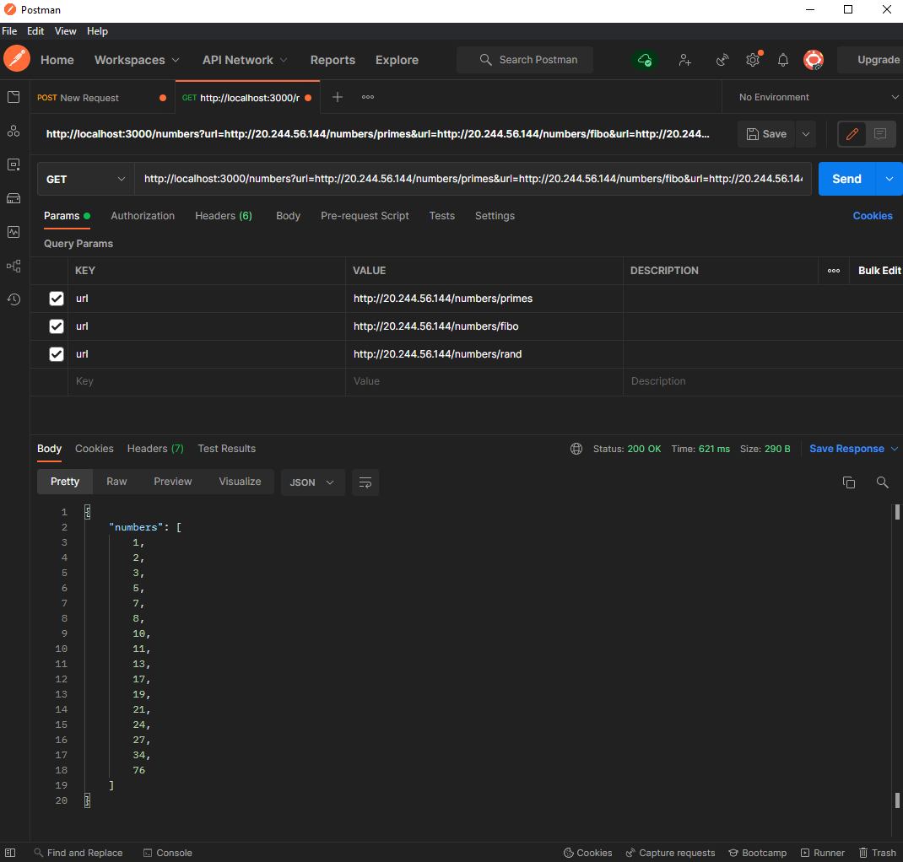

# 2029165

## Task 1 - Train data

## Task 2 - Number Manamgement

- The response sometimes returns the error "error occured". It is because the response is taking more than 500ms (due to several reasons like huge data or high traffic in the API call).
- As clearly mentioned in the question, the given timeout is strictly respeced in the code.
- the response received from the tastcase is same as given in the document.

